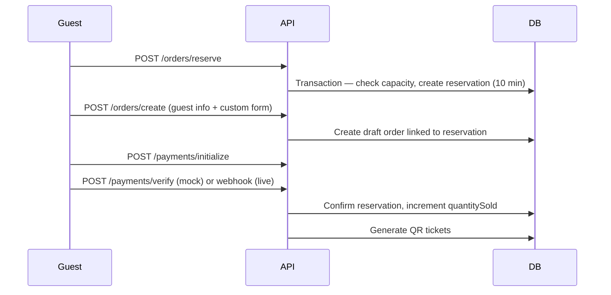
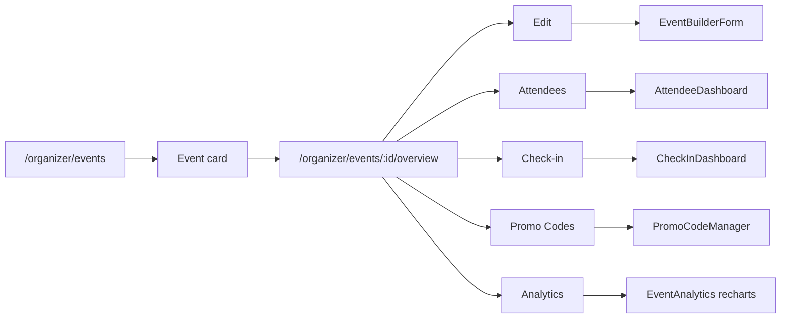
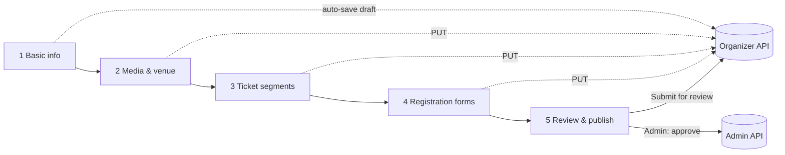
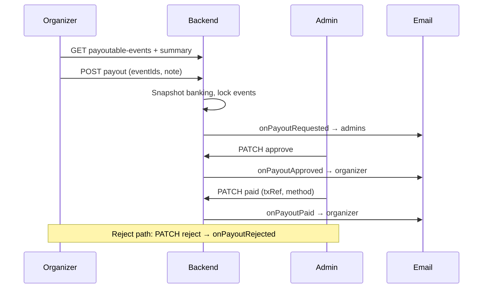

# Eventisa — Event Platform

Production-grade, scalable event ticketing. **Frontend** (Next.js 15) and **backend** (Express + MongoDB) are fully separated.

## Architecture

```
Tick/
├── frontend/     → Next.js 15 App Router → deploy to Vercel
├── backend/      → Express + Mongoose → deploy separately
├── docker-compose.yml → local MongoDB replica set
├── scripts/      → mongo init, seed
└── docs/         → architecture, payments, deployment (API table lives in this README)
```

### Backend (modular monolith)

Each domain under `backend/src/modules/<name>/`:

- `routes` → `controllers` → `services` → `models`
- Shared: RBAC, JWT auth, Zod validation, Winston logger, centralized errors
- Domains include: `auth`, `events`, `orders`, `tickets`, `payments`, `checkin`, `uploads`, `about` (team members), `admin`, `admin-auth`, `homepage`, `cities`, `venues`, `users`, and more

### Frontend

- **Pages**: one `page.tsx` per route under `src/app/` (route groups: `(public)`, `(marketing)`, `(events)`, `(auth)`, `(user)`, `(organizer)`, `(admin)`, `(checkout)`, …)
- **Services**: Axios API layer (`src/services/`)
- **Components**: reusable UI (`src/components/`)
- **State**: Zustand (auth) + TanStack Query (server data)
- **Config**: `src/config/routes.ts`, `src/config/contact.ts` (public support details)

### Roles

| Role | Value | Access |
|------|-------|--------|
| Guest | `guest` | Browse events |
| User | `user` | Tickets, orders, profile |
| Organizer | `organizer` | Create events (after admin approval) |
| Admin | `admin` | Approve organizers & events |
| Super Admin | `super_admin` | Full platform control |

---

## Prerequisites

- Node.js 20+
- MongoDB running locally

---

## MongoDB (localhost)

Tick uses **multi-document transactions** (ticket reservations). MongoDB must run as a **replica set**, even with one node.

### Option A — Docker (recommended)

```bash
# From repo root
docker compose up -d
docker compose up mongo-init   # runs rs.initiate() once (idempotent)

# Connection string (also in backend/.env)
mongodb://localhost:27017/eventisa?replicaSet=rs0
```

Config: `docker-compose.yml` — `mongod --replSet rs0`. Init script: `scripts/init-mongo-replica-set-docker.js`.

### Option B — macOS Homebrew

1. Stop standalone MongoDB: `brew services stop mongodb-community`
2. Add replica set to your `mongod.conf` (see `config/mongod.replica-set.conf` for a template):

   ```yaml
   replication:
     replSetName: rs0
   ```

3. Start MongoDB: `brew services start mongodb-community` (or `mongod --config …`)
4. Init the replica set once:

   ```bash
   mongosh "mongodb://127.0.0.1:27017" --file scripts/init-mongo-replica-set.js
   ```

5. Set `MONGO_URI=mongodb://localhost:27017/eventisa?replicaSet=rs0` in `backend/.env`

---

## Environment setup

### Backend

```bash
cd backend
cp .env.example .env
```

Edit `.env` — **required** (min 32 chars for JWT secrets). See `backend/.env.example` for the full list.

```env
# Use 5001 on macOS if port 5000 is taken by AirPlay Receiver
PORT=5001
MONGO_URI=mongodb://localhost:27017/eventisa?replicaSet=rs0
JWT_ACCESS_SECRET=your_access_secret_min_32_chars_here
JWT_REFRESH_SECRET=your_refresh_secret_min_32_chars_here
CLIENT_URL=http://localhost:3000
API_PREFIX=/api
```

**Optional (recommended for local dev):**

| Variable | Purpose |
|----------|---------|
| `JWT_ADMIN_ACCESS_SECRET`, `JWT_ADMIN_REFRESH_SECRET` | Admin portal JWT (optional; defaults derived from main secrets) |
| `PAYMENT_MODE` | `mock` (default) — demo checkout without gateway credentials |
| `SMTP_*`, `FRONTEND_URL` | Gmail transactional email (see [Email notifications](#email-notifications-gmail-smtp)) |
| `UPLOAD_PROVIDER=local` | Event/organizer images via `POST /api/uploads` (use `cloudinary` in production) |
| `CLOUDINARY_CLOUD_NAME`, `CLOUDINARY_API_KEY`, `CLOUDINARY_API_SECRET` | Required when `UPLOAD_PROVIDER=cloudinary` |
| `CLOUDINARY_FOLDER` | Cloudinary root folder prefix (default `eventisa`) |
| `API_PUBLIC_URL` | Base URL for local upload URLs (e.g. `http://localhost:5001`) |

### Frontend

```bash
cd frontend
cp .env.example .env.local
```

```env
NEXT_PUBLIC_API_URL=http://localhost:5001/api
# Or use same-origin proxy: NEXT_PUBLIC_API_URL=/api
# (Next.js rewrites /api → backend; see frontend/next.config.ts)
NEXT_PUBLIC_APP_URL=http://localhost:3000
NEXT_PUBLIC_APP_NAME=Eventisa
```

---

## Install dependencies

```bash
# Backend
cd backend && npm install

# Frontend
cd frontend && npm install
```

---

## Run development

**Terminal 1 — Backend** (default port **5001** in `.env.example`; use 5000 if you prefer):

```bash
cd backend
npm run dev
```

API health: http://localhost:5001/api/health (adjust port if needed)

**Terminal 2 — Frontend** (port 3000):

```bash
cd frontend
npm run dev
```

App: http://localhost:3000

---

## Seed demo data

```bash
cd backend
npm run seed
```

Creates: 1 super admin, 1 admin, 1 moderator, 2 organizers, 12 live events, sample paid orders & QR tickets.  
Password for all accounts: `Password123`

**Super admin** (`superadmin@eventisa.com`) can manage About page team, platform tracking, and all super-admin settings.

---

## Booking & reservation flow



**Reservation states:** `reserved` → `paid` | `expired` | `cancelled`  
**Order payment:** `pending` → `paid` | `failed` | `refunded`

Inventory formula per section:

`available = capacity - quantitySold - activeReservations`

Concurrency: MongoDB transactions on reserve & confirm.

---

## Checkout architecture (frontend)

| Step | Route | Action |
|------|-------|--------|
| 1 Tickets | `/cart` | Select qty → `POST /orders/reserve` |
| 2 Details | `/checkout` | Guest form (BD phone) → `POST /orders/create` |
| 3 Payment | `/checkout` | Select method → `POST /payments/initialize` → Demo Payment (mock) |
| 4 Confirm | `/checkout/success` | View digital tickets |

State: Zustand `checkout.store` (persisted sessionId + reservation).

---

## Admin approval workflow

1. Organizer saves draft → `POST /organizer/events`
2. Submit for review → `POST /organizer/events/:id/submit-for-review` (status `pending`)
3. Admin reviews → `/admin/events/pending`
4. Approve → `PATCH /admin/events/:id/approve` (status `live`)
5. Reject / request changes → `PATCH reject` or `request-changes`
6. Listing control → `PATCH /admin/events/:id/moderation` (`featured`, `trending`, `listingRank`)

---

## API endpoints

### Auth & events
| Method | Path | Description |
|--------|------|-------------|
| POST | `/api/auth/register` | Register user (no JWT until email verified) |
| POST | `/api/auth/login` | Login (rate limited; requires verified email) |
| POST | `/api/auth/verify-email` | Verify email from link (`{ token, email }`) |
| POST | `/api/auth/resend-verification` | Resend verification email (rate limited) |
| GET | `/api/auth/me` | Current user (JWT only; works before verify) |
| GET | `/api/events` | List live events (ranked) |
| GET | `/api/events/slug/:slug` | Event detail |
| GET | `/api/public/organizers/showcase` | Homepage “Trusted by Top Organizers” (approved; live events or uploaded logo) |
| GET | `/api/public/homepage/featured-events` | Admin-curated featured events (ordered); **powers homepage hero carousel** |
| GET | `/api/public/homepage/trending-events` | Admin-curated trending events (ordered) |
| GET | `/api/public/hero-banners` | Active hero slides (admin CRUD; optional — homepage hero uses featured events, not this endpoint) |
| GET | `/api/public/cities` | Active cities for filters & browsing |
| GET | `/api/public/venues` | Active venues (`?city=` optional) |
| GET | `/api/public/team-members` | Active team members for About page (sorted by `order`, 5 min cache) |
| GET | `/api/public/tracking-config` | Platform Meta Pixel / GA4 / GTM IDs (cached 5 min) |
| GET | `/api/public/platform-status` | Maintenance mode + service fee for public UI |

### Orders & tickets
| Method | Path | Description |
|--------|------|-------------|
| POST | `/api/orders/reserve` | Hold inventory (guest OK) |
| POST | `/api/orders/create` | Create order from reservation |
| POST | `/api/orders/:id/cancel` | Cancel & release hold |
| GET | `/api/orders/:id` | Order details |
| POST | `/api/checkout/complete` | Legacy / paymentId fulfillment |
| POST | `/api/tickets/generate` | Generate tickets (paid orders) |
| GET | `/api/tickets/:id` | Ticket + QR |

### Payments (adapter architecture)
| Method | Path | Description |
|--------|------|-------------|
| GET | `/api/payments/config` | Global methods + feature flags |
| GET | `/api/payments/config/event/:eventId` | Checkout config for event’s assigned gateway |
| GET | `/api/events/:eventId/gateway-info` | Public: displayName, logo, provider only |
| POST | `/api/payments/initialize` | Start payment (uses event gateway when `PAYMENT_MODE=live`) |
| POST | `/api/payments/verify` | Verify & fulfill order |
| POST | `/api/payments/mock/simulate` | Dev: success / failed / cancelled |
| GET | `/api/payments/status/:paymentId` | Payment status |
| POST | `/api/payments/callback/sslcommerz` | SSLCommerz return / IPN |
| POST/GET | `/api/payments/callback/bkash` | bKash callback |
| POST | `/api/payments/callback/nagad` | Nagad callback |
| GET | `/api/admin/payment-gateways` | List gateways (admin, includes credentials) |
| POST | `/api/admin/payment-gateways` | Create gateway |
| PATCH | `/api/admin/payment-gateways/:id` | Update gateway |
| DELETE | `/api/admin/payment-gateways/:id` | Delete (blocked if used by live events) |
| PATCH | `/api/admin/payment-gateways/:id/set-default` | Set platform default |
| PATCH | `/api/admin/events/:eventId/assign-gateway` | Assign gateway to event |
| PATCH | `/api/admin/events/:eventId/remove-gateway` | Revert to platform default |
| GET | `/api/admin/events/:eventId/gateway-assignment` | Assignment metadata for admin UI |

### Organizer
| Method | Path | Description |
|--------|------|-------------|
| GET/POST | `/api/organizer/events` | List (search, status, sort) / create |
| GET | `/api/organizer/events/:eventId/overview` | Per-event stats + segments + recent activity |
| GET | `/api/organizer/events/:eventId/analytics` | Sales/revenue charts data |
| POST | `/api/organizer/events/:eventId/publish` | Publish (approved events) |
| POST | `/api/organizer/events/:eventId/unpublish` | Unpublish live event |
| PUT | `/api/organizer/events/:id` | Update |
| POST | `/api/organizer/events/:id/submit-for-review` | Submit for approval |
| POST | `/api/organizer/events/:id/duplicate` | Duplicate event |
| GET | `/api/organizer/settings` | Profile, organization, notifications, masked banking |
| PATCH | `/api/organizer/profile` | Name, phone, bio, social links |
| PATCH | `/api/organizer/organization` | Org details, logo/cover (base64), address, city |
| PATCH | `/api/organizer/notification-preferences` | Email toggle preferences |
| PATCH | `/api/organizer/banking` | Payout details (resets `bankingVerified`) |
| GET | `/api/organizer/payouts` | Payout history (`status`, `page`, `limit`) |
| GET | `/api/organizer/payouts/summary` | Earnings summary + available balance |
| GET | `/api/organizer/payouts/payoutable-events` | Events eligible for payout request |
| POST | `/api/organizer/payouts` | Create payout `{ eventIds[], requestNote? }` |
| GET | `/api/organizer/payouts/:payoutId` | Payout detail (organizer-owned) |
| POST | `/api/organizer/change-password` | `{ currentPassword, newPassword }` |
| POST | `/api/organizer/delete-account` | `{ confirmation: "DELETE" }` — blocked if active/upcoming events |

### Admin
| Method | Path | Description |
|--------|------|-------------|
| GET | `/api/admin/events/pending` | Pending queue |
| PATCH | `/api/admin/events/:id/approve` | Go live |
| PATCH | `/api/admin/events/:id/reject` | Reject |
| PATCH | `/api/admin/events/:id/moderation` | Featured / trending flags (fallback when no manual curation) |
| GET | `/api/admin/homepage-control/featured-events` | Load featured homepage lineup |
| PUT | `/api/admin/homepage-control/featured-events` | Save `{ featuredEventIds: string[] }` (drag order) |
| GET | `/api/admin/homepage-control/trending-events` | Load trending homepage lineup |
| PUT | `/api/admin/homepage-control/trending-events` | Save `{ trendingEventIds: string[] }` (drag order) |
| GET/POST/PATCH/DELETE | `/api/admin/hero-banners` | Hero slide CRUD (`HeroBanner` model) |
| GET/POST/PATCH/DELETE | `/api/admin/cities` | City directory CRUD |
| GET/POST/PATCH/DELETE | `/api/admin/venues` | Venue directory CRUD |
| GET/PUT/PATCH | `/api/admin/homepage-control` | Full homepage config (legacy embedded banners, etc.) |
| GET/POST/PATCH/DELETE | `/api/admin/team-members` | About page team CRUD (**super_admin only**) |
| GET/PATCH | `/api/admin/settings` | Platform settings read; section PATCH (super_admin for writes) |
| PATCH | `/api/admin/settings/tracking` | Meta Pixel / GA4 / GTM IDs (**super_admin only**) |
| GET | `/api/admin/analytics/overview` | Platform overview stats (`analytics.view`) |
| GET | `/api/admin/analytics/revenue?days=30` | Daily revenue + orders (7 \| 30 \| 90 \| 365) |
| GET | `/api/admin/analytics/tickets?days=30` | Daily tickets sold |
| GET | `/api/admin/analytics/users?days=30` | Daily new user signups |
| GET | `/api/admin/analytics/events?days=30` | Daily events created |
| GET | `/api/admin/analytics/by-category` | Revenue breakdown by event category |
| GET | `/api/admin/analytics/by-city` | Revenue breakdown by city (top 10) |
| GET | `/api/admin/analytics/top-events?limit=10` | Top events by revenue |
| GET | `/api/admin/analytics/top-organizers?limit=10` | Top organizers by revenue |
| GET | `/api/admin/analytics/order-status` | Order payment/status breakdown |
| GET | `/api/admin/analytics/recent` | Recent orders, events, organizer applications |
| GET | `/api/admin/finance/payouts` | Payout queue (`status`, `search`, `dateFrom`, `dateTo`, `page`, `limit`) — `payments` permission |
| GET | `/api/admin/finance/payouts/stats` | Pending / approved / paid stats |
| GET | `/api/admin/finance/payouts/:payoutId` | Payout detail + per-event breakdown |
| PATCH | `/api/admin/finance/payouts/:id/approve` | Approve pending request |
| PATCH | `/api/admin/finance/payouts/:id/reject` | Reject `{ reason }` |
| PATCH | `/api/admin/finance/payouts/:id/paid` | Mark paid `{ txRef, paymentMethod, paymentNote? }` |

---

## Scripts

| Package | Command | Description |
|---------|---------|-------------|
| backend | `npm run dev` | Start API with tsx watch |
| backend | `npm run build` | Compile TypeScript |
| backend | `npm run start` | Run compiled `dist/index.js` |
| backend | `npm run seed` | Seed demo data |
| backend | `npm run migrate:images` | Migrate legacy base64 images to Cloudinary |
| backend | `npm run lint` / `lint:fix` | ESLint |
| backend | `npm run typecheck` | TypeScript check |
| backend | `npm run format` / `format:check` | Prettier |
| frontend | `npm run dev` | Next.js dev server (port 3000) |
| frontend | `npm run dev:clean` | Clear `.next` cache + dev |
| frontend | `npm run build` | Production build (Vercel) |
| frontend | `npm run build:clean` | Clear cache + production build |
| frontend | `npm run start` | Serve production build |
| frontend | `npm run lint` / `lint:fix` | Next.js ESLint |
| frontend | `npm run typecheck` | TypeScript check |
| frontend | `npm run format` / `format:check` | Prettier |

**Docker (MongoDB only):** `docker compose up -d` then `docker compose up mongo-init` from repo root.

---

## Deployment

- **Frontend**: Vercel — root directory `frontend/`, set `NEXT_PUBLIC_API_URL` to your public API (or `/api` with a reverse proxy)
- **Backend**: Railway / Render / AWS — set `MONGO_URI`, JWT secrets, `CLIENT_URL`, `FRONTEND_URL`, `SMTP_*`, `PAYMENT_MODE`
- **MongoDB**: Must be a replica set in production (transactions for reservations)

See `docs/deployment/README.md` for details.

> **Note:** `docs/api/README.md` is a stub; this README’s [API endpoints](#api-endpoints) section is the current route reference.

---

## Payment system (Phase 4)

Modular provider architecture with **admin-managed gateways** (SSLCommerz, bKash, Nagad).

```
backend/src/modules/payments/
├── models/
│   ├── payment.model.ts
│   └── paymentGateway.model.ts   ← admin credentials store
├── providers/
│   ├── mock.provider.ts          ← PAYMENT_MODE=mock
│   ├── sslcommerz.provider.ts    ← dynamic credentials per gateway
│   ├── bkash.provider.ts         ← token grant → create → execute
│   └── nagad.provider.ts
├── services/
│   ├── payment.service.ts
│   ├── gatewayManager.service.ts ← CRUD + event assignment
│   ├── gatewayRouter.service.ts  ← routes checkout to event gateway
│   └── payment-callback.service.ts
└── config → backend/src/config/payment.config.ts
```

### PaymentGateway model

| Field | Description |
|-------|-------------|
| `name` | Admin internal label |
| `provider` | `sslcommerz` \| `bkash` \| `nagad` |
| `displayName` | Shown to buyers at checkout |
| `credentials` | Provider-specific secrets (never exposed publicly) |
| `isDefault` | Platform fallback when event has no assignment |
| `isActive` | Disabled gateways cannot be assigned |

Event fields: `paymentGatewayId`, `paymentGatewayAssignedBy`, `paymentGatewayAssignedAt`.

### Gateway assignment flow

1. Admin creates gateways at **Admin → Finance → Payment Gateways** (`/admin/payment-gateways`).
2. Optionally set one gateway as **platform default**.
3. On an event **Overview**, use **Assign Gateway** or **Use Default**.
4. Checkout loads `GET /api/events/:eventId/gateway-info` and pays via `gatewayRouter` when `PAYMENT_MODE=live`.

`getEventGateway(eventId)` resolution order: event assignment → platform default → any active gateway → env SSLCommerz fallback.

### Mock payment (local)

```env
PAYMENT_MODE=mock
```

Checkout shows **Demo Payment**; gateway info still displays the assigned provider name/logo.

Flow: initialize → 2s delay → simulate success → tickets issued.

### bKash + Nagad integration notes

- **bKash** (Payment Gateway API v1.2.0): grant token → `checkout/create` → redirect to `bkashURL` → callback → `checkout/execute`. Credentials: `appKey`, `appSecret`, `username`, `password`, `sandbox`.
- **Nagad**: initialize with signed payload → redirect → callback verifies `status`. Credentials: `merchantId`, `merchantNumber`, `pubKey`, `privKey`, `sandbox`.
- **SSLCommerz**: session API with per-gateway `storeId` / `storePass` (replaces hardcoded `.env` when a gateway is assigned).

Set `PAYMENT_MODE=live` and configure gateways in admin to enable live redirects.

### Enable SSLCommerz later (no rewrite)

1. Add `SSLCOMMERZ_STORE_ID` + `SSLCOMMERZ_STORE_PASSWORD` to `.env`
2. Fill in TODO sections in `sslcommerz.provider.ts`
3. Implement `webhook/sslcommerz` controller
4. Set `ENABLE_SSL=true` and `PAYMENT_MODE=live`

Same pattern for bKash (`BKASH_APP_KEY`, `ENABLE_BKASH`) and Nagad (`NAGAD_MERCHANT_ID`, `ENABLE_NAGAD`).

See `docs/payments/README.md` for details.

---

## Payment architecture tree

```
Tick/
├── backend/src/
│   ├── config/payment.config.ts
│   └── modules/payments/
│       ├── interfaces/payment-provider.interface.ts
│       ├── providers/ (mock + gateway stubs)
│       ├── services/payment.service.ts
│       ├── models/payment.model.ts
│       ├── controllers/ + webhook.controller.ts
│       └── routes/payment.routes.ts
└── frontend/src/
    ├── services/payments/payments.service.ts
    └── components/checkout/
        ├── payment-method-selector.tsx
        ├── payment-trust-badges.tsx
        └── checkout-payment-step.tsx
```

---

## Phase 5 — Premium frontend (UI/UX + SEO)

### Design system v2 (`frontend/src/design-system/`)

Luxury dark event theme: purple neon primary, magenta accent, glass surfaces, motion tokens, gradients, elevation.

**Fonts:** Clash Display (display), Inter (UI), Hind Siliguri (Bengali copy).

### Homepage (`/`)

**Current sections** (top → bottom):

| Section | Component | Source / notes |
|---------|-----------|----------------|
| Hero | `hero-section.tsx` | **Featured-events carousel** (`GET /api/public/homepage/featured-events`): banner/cover image, title, date, venue, **Get Tickets** CTA; 5s auto-play, dots + arrows, pause on hover; static fallback when no images |
| Hero trust bar | (bottom of hero) | Easy Booking · Secure Payment · Instant Tickets · Best Events (single row on mobile) |
| Categories | `categories-section.tsx` | Lucide icons; 8 tiles + “More” → `/categories` |
| Trending | `trending-events-section.tsx` | Curated trending API, else `trending` flag |
| Featured | `featured-events-section.tsx` | Same curated list as hero data source |
| Trusted by Top Organizers | `OrganizerShowcase.tsx` | `GET /api/public/organizers/showcase` — **horizontal auto-scroll marquee** |
| This week | `upcoming-week-section.tsx` | Events starting within the week |
| Platform offerings | `OfferingsSection.tsx` | Six feature cards (ticketing, payments, QR, dashboard, check-in) |
| Testimonials | `testimonials-section.tsx` | Static marketing copy |
| CTA | `cta-section.tsx` | Become organizer / browse |

**Homepage data fetch** (`app/page.tsx`): `fetchHomeEvents`, `fetchCuratedFeaturedEvents`, `fetchCuratedTrendingEvents`, `fetchOrganizerShowcaseServer` — no separate hero-banner fetch on `/`.

**Mobile layout:** Section vertical padding is tighter below `md:` (e.g. `py-8` vs `py-16` on desktop).

Removed from homepage (components may still exist for reuse): Popular cities strip, hero inline search/filter bar, Popular organizers strip, Featured venues.

### Site chrome (nav & footer)

**Header** (`site-header.tsx`): Home · Events · About Us · Contact Us · search icon · login/sign up.

**Footer** (`site-footer.tsx`): 4-column layout — brand + trade license + socials; **More info** (FAQ, About Us, Contact Us); **Legals** (Privacy, Refund, Terms); **Contacts** (address, phone, email from `frontend/src/config/contact.ts`); bottom bar with payment labels + copyright.

**Contact page** (`/contact`): `app/(public)/contact/page.tsx` + `components/contact/ContactPage.tsx` — hero, WhatsApp/email cards, address/phone, social links, client-validated contact form (simulated submit; no backend endpoint yet).

### Event cards (`frontend/src/components/events/cards/`)

| Variant | File |
|---------|------|
| Grid (default) | `event-card-grid.tsx` |
| Featured | `event-card-featured.tsx` |
| Compact | `event-card-compact.tsx` |
| Carousel | `event-card-carousel.tsx` |

Shared: cover, badges (trending/sold out), wishlist, hover lift + glow.

### Discovery routes

| Route | Features |
|-------|----------|
| `/events` | Sticky filter panel, sort, client filters (city, date, today, weekend, trending, free, price) |
| `/search` | Debounced query |
| `/categories` | Category grid (Lucide icons; links filter `/events?category=`) |
| `/about` | Brand intro, values, team profiles (`GET /api/public/team-members`), mission |
| `/contact` | Full contact page (info cards + form UI) |
| `/faq` | FAQ accordion (`lib/faq/faq-content.ts`) |
| `/how-it-works` | Placeholder |
| `/terms`, `/privacy` | Legal content pages |
| `/refund-policy` | Placeholder (linked from footer) |

### Event detail v2 (`/event/[slug]`)

Server metadata + JSON-LD (Event, Breadcrumb). Sections: hero, sticky ticket panel, schedule, map, organizer, FAQ, terms, similar events, mobile sticky CTA. Platform Meta Pixel fires `ViewContent` via `EventViewContentTracker`; legacy per-event tracking scripts render only when an event has its own pixel configured.

### SEO foundation

| File | Purpose |
|------|---------|
| `app/robots.ts` | Crawl rules |
| `app/sitemap.ts` | Static + dynamic event URLs |
| `app/manifest.ts` | PWA manifest |
| `lib/seo/event-metadata.ts` | OG + Twitter per event |

### Component tree (new / updated)

```
frontend/src/
├── design-system/          # colors, spacing, typography, motion, glass…
├── components/
│   ├── events/cards/       # premium event cards
│   ├── event-detail/       # detail page sections
│   ├── home/               # hero-section, categories, featured, trending, OrganizerShowcase, OfferingsSection, …
│   ├── contact/            # ContactPage
│   ├── layout/footer/      # site-footer.tsx
│   ├── layout/header/      # site-header.tsx
│   ├── organizers/         # organizer-logo (base64-aware)
│   ├── empty-states/       # empty-events, search, sold-out, payment, tickets
│   └── seo/                # JSON-LD + tracking scripts
├── lib/
│   ├── categories/           # event-categories.ts (taxonomy + Lucide icons)
│   ├── events/             # filter-events, event-utils
│   ├── home/               # fetch-home-events, fetch-featured-events, fetch-organizer-showcase, fetch-homepage-data
│   └── seo/                # metadata, sitemap-data
├── config/
│   └── contact.ts          # Shared phone, email, address, WhatsApp URL (footer + contact page)
└── app/
    ├── robots.ts | sitemap.ts | manifest.ts
    ├── (events)/events/ | search/ | event/[slug]/
    ├── (public)/contact/     # Contact Us page
    └── page.tsx            # homepage
```

### Lighthouse strategy (target 90+)

- Server Components for homepage + event detail (less JS)
- `loading.tsx` on `/events` and `/event/[slug]`
- `priority` on first hero slide image only
- Debounced search; TanStack Query caching
- Next.js `images.remotePatterns` for CDN covers
- Run: `npm run build && npx lighthouse http://localhost:3000 --view` (with API + Mongo seeded)

## Brand positioning

**Eventisa** is the premium destination for **all events in Bangladesh** — not a campus-only platform.

- Concerts, conferences, festivals, sports, comedy, career fairs, university fests, corporate summits & more
- Visual direction: dark luxury (`#070B1A`), neon concert lighting, pink CTA (`#FF3EA5`), purple highlights (`#9B5CFF`)
- University/campus features are **one optional category** (organizer tab: “Campus & extras”)

Category taxonomy: `frontend/src/lib/categories/event-categories.ts`

---

## Phase 6 — Media + university events + hardening

### Upload architecture (`backend/src/modules/uploads/`)

| Layer | Role |
|-------|------|
| `providers/local.provider.ts` | Dev — files under `uploads/`, served at `/api/uploads/files` |
| `providers/cloudinary.provider.ts` | Production — uploads via `shared/upload/cloudinary.service.ts` |
| `shared/upload/cloudinary.service.ts` | Cloudinary SDK wrapper (`uploadImage`, `deleteImage`, `uploadFromBase64`) |
| `services/upload.service.ts` | MIME magic-byte check, size limits, Sharp → WebP (local path) |
| `POST /api/uploads?type=` or `?folder=` | Multipart upload (`file` field); **user or admin JWT** (`authenticateUserOrAdmin`) |

**Cloudinary image types only** (no gallery, no avatars):

| Image | API folder | Stored field |
|-------|------------|--------------|
| Event banner / cover | `events/banners` | `Event.coverImage` + `coverImagePublicId` |
| Organizer logo | `organizers/logos` | `Organizer.logo` + `logoPublicId` |
| Organizer cover | `organizers/covers` | `Organizer.banner` + `bannerPublicId` |
| Team member photo | `speakers/images` (`type=speaker-image`) | `TeamMember.imageUrl` + `imagePublicId` |

Cloudinary folder layout: `{CLOUDINARY_FOLDER}/events/banners`, `…/organizers/logos`, `…/organizers/covers`.

Upload options: `quality: auto`, `fetch_format: auto` (WebP when supported).

**Migrate legacy base64 rows:** `cd backend && npm run migrate:images` (requires `UPLOAD_PROVIDER=cloudinary`).

See `docs/phase-6-cloudinary.md` for setup.

### University event system

- Event types: fest, club, seminar, hackathon, career fair, etc.
- Fields: `universityName`, `department`, `clubName`, `batch`, `session`
- Restrictions: `studentOnly`, `requiresStudentId`, `allowedEmailDomains` (e.g. `@buet.ac.bd`)
- Enforced at order creation (`validateUniversityRegistration`)

### QR check-in flow

1. Guest receives QR ticket after paid checkout (unchanged ticket engine)
2. Organizer opens `/organizer/checkin`, selects event
3. `POST /api/organizer/checkin/scan` with QR JSON or `manual` with ticket number
4. Ticket status `active` → `used` (display: **checked-in**), duplicate scan returns 409

### Analytics (`/api/analytics/organizer`, `/api/analytics/admin`)

Organizer: tickets sold, revenue, conversion, popular sections, check-in stats.  
Admin: platform revenue, top events, growth (30d).  
Frontend: Recharts on `/organizer/analytics`.

### Notifications

**Production email:** Gmail SMTP via `backend/src/shared/email/` (ticket confirmed, reminders, organizer/event approval, etc.). See [Email notifications](#email-notifications-gmail-smtp).

**Legacy queue:** `modules/notifications` model + `enqueueNotification` — optional Bull/Redis worker for future channels; checkout uses SMTP triggers directly.

### New routes

| Route | Description |
|-------|-------------|
| `POST /api/uploads` | Media upload |
| `POST /api/organizer/checkin/scan` | QR check-in |
| `POST /api/organizer/checkin/manual` | Manual check-in |
| `GET /api/organizer/checkin/stats` | Attendance stats |
| `GET /api/analytics/organizer` | Organizer dashboard data |
| `GET /api/analytics/admin` | Admin dashboard data |
| `/organizer/[slug]` | Public organizer profile (logo, banner, past events) |
| `/organizer/checkin` | Mobile check-in UI |
| `/organizer/analytics` | Charts dashboard |

### Architecture tree (Phase 6)

```
backend/src/modules/
├── uploads/          # local + cloudinary providers
├── checkin/          # scan, manual, stats
├── notifications/    # queued jobs (mock send)
└── analytics/        # organizer + admin aggregates

frontend/src/
├── components/media/           # image-upload, optimized-image
├── components/event-detail/     # sponsors, university badge, schedule, location
├── components/organizer/       # media + university builder tabs
├── components/analytics/       # recharts
└── app/organizer/[slug]/       # public profile
```

## Phase 7 — Admin control center (isolated auth)

### Admin auth flow

1. Staff opens **`/admin/login`** (not `/login`)
2. `POST /api/admin/auth/login` → sets **`admin_access_token`** + **`admin_refresh_token`** (separate secrets from public auth)
3. User/organizer cookies are **rejected** on `/api/admin/*`; admin cookies are **rejected** on `/api/auth/*`
4. Middleware redirects unauthenticated `/admin/*` → `/admin/login`

### Seed staff accounts (`npm run seed`)

| Email | Staff role | Password |
|-------|------------|----------|
| `superadmin@eventisa.com` | super_admin | `Password123` |
| `admin@eventisa.com` | admin | `Password123` |
| `moderator@eventisa.com` | moderator | `Password123` |

Public accounts unchanged: `user@eventisa.com`, `organizer1@eventisa.com` → use `/login`.

### Staff roles & permissions

| Staff role | Key permissions |
|------------|-----------------|
| `super_admin` | All |
| `admin` | All |
| `moderator` | Events moderate, organizers, audit |
| `support_agent` | Users, orders, audit |
| `finance_manager` | Payments, refunds, orders, analytics |
| `content_manager` | Homepage, SEO, categories, event featuring |

Matrix: `backend/src/shared/permissions/admin-permissions.ts`

### Admin API routes

```
/api/admin/auth/login|logout|refresh|me
/api/admin/dashboard
/api/admin/events/*          (moderation + listing)
/api/admin/events/:eventId/overview
/api/admin/events/:eventId/bookings (+ export, refund, cancel, resend-email)
/api/admin/events/:eventId/segments/:segmentId/admin-update
/api/admin/events/:eventId/attendees|checkin|promo-codes|analytics  (admin auth bridge)
/api/admin/analytics/overview|revenue|tickets|users|events|by-category|by-city|top-events|top-organizers|order-status|recent
/api/admin/homepage-control
/api/admin/homepage-control/featured-events
/api/admin/homepage-control/trending-events
/api/admin/hero-banners
/api/admin/cities
/api/admin/venues
/api/admin/team-members          (super_admin only)
/api/admin/payment-gateways
/api/admin/audit-logs
```

### Admin frontend routes

```
/admin/login
/admin/dashboard
/admin/events, /admin/events/pending, /admin/events/create
/admin/events/[id]/overview|bookings|attendees|segments|checkin|promo-codes|analytics|edit
/admin/featured-events          # drag-order homepage featured events
/admin/trending-events          # drag-order homepage trending events
/admin/hero-banners             # hero slide CRUD
/admin/cities                   # city directory (page exists; not in sidebar nav)
/admin/venues                   # venue directory (page exists; not in sidebar nav)
/admin/about-team               # About page team CRUD (super_admin only)
/admin/payment-gateways         # SSLCommerz / bKash / Nagad credentials
/admin/users, /admin/organizers, /admin/orders, /admin/payments, /admin/finance
/admin/homepage-control         # placeholder — use dedicated pages above
/admin/analytics                 # platform-wide charts + tables (implemented)
/admin/audit-logs, /admin/settings, …
```

Shell: `frontend/src/components/admin/admin-shell.tsx` + sidebar nav.

**Admin event hub** (`/admin/events/[id]/*`):

```
frontend/src/components/admin/
├── layout/AdminSidebar.tsx, AdminHeader.tsx
├── dashboard/AdminStats.tsx, AdminCharts.tsx, …
└── events/
    ├── AdminEventNav.tsx, AdminEventManageHeader.tsx
    ├── AdminEventOverview.tsx, EventBookingTable.tsx, BookingDetailDrawer.tsx
    ├── AdminSegmentTable.tsx, RejectModal.tsx
    └── AdminEventTable.tsx (title → overview, Manage button)

backend/src/modules/admin/
├── services/adminEventDetail.service.ts
├── controllers/adminEventDetail.controller.ts
└── routes/admin-event-detail.routes.ts  (mounted under /api/admin/events/:eventId)
```

Reuses organizer UI (no rebuild): `AttendeeDashboard`, `CheckInDashboard`, `PromoCodeManager`, `EventAnalytics` — wired with `apiMode` / `apiScope` to admin API paths.

### Security model

- Separate JWT secrets (`JWT_ADMIN_ACCESS_SECRET`, optional in `.env`)
- RBAC: `adminAuthenticate` + `requirePermission(...)`
- Audit log on login, event approve/reject
- Rate limit disabled in development only

### Architecture (admin modules)

```
backend/src/modules/
├── admin-auth/       # login, refresh, admin refresh tokens
├── admin-dashboard/  # control center metrics
├── audit/            # audit logs
└── homepage/         # homepage config CRUD

backend/src/shared/
├── permissions/admin-permissions.ts
├── middleware/auth/admin-authenticate.middleware.ts
└── utils/admin-jwt.util.ts | admin-cookie.util.ts
```

## Phase 8 — Dynamic event form + ticket segment builder

### Form engine

Organizers and admins define registration fields visually — no hardcoded event-type forms.

**Field types:** `text`, `textarea`, `email`, `phone`, `number`, `date`, `time`, `select`, `multi-select`, `radio`, `checkbox`, `toggle`, `file`, `image`, `url`, `social`, plus advanced: `student-id`, `university`, `department`, `company`, `designation`, `experience-level`.

**Per-field options:** label, placeholder, required, helper text, default value, hidden, readonly, min/max/regex validation, **conditional show** (`showWhen`).

Backend validation: `backend/src/modules/forms/services/form-validation.service.ts`  
Conditional logic: `backend/src/modules/forms/services/conditional-form.util.ts`

### Ticket segments (unlimited)

Each `ticketSections[]` entry is a segment with:

| Field | Purpose |
|-------|---------|
| `title`, `description` | Segment label |
| `price`, `isFree` | Paid vs free |
| `capacity`, `quantitySold` | Inventory |
| `maxPurchase`, `minPurchase` | Per-order limits |
| `saleStart`, `saleEnd` | Sale window |
| `status` | `draft` \| `active` \| `soldout` \| `hidden` \| `expired` |
| `formEnabled`, `formFields[]` | **Segment-specific form** |

Event-wide `customForm` is a fallback when a segment has no `formFields`.

### Data structure

```
event
├── customForm { enabled, fields[] }
└── ticketSections[]
    ├── title, price, isFree, capacity, …
    └── formFields[]   ← segment form overrides event form
```

### Free ticket flow

```
Reserve → Guest + dynamic form → Create order (total = 0)
→ POST /api/orders/:id/confirm-free → Tickets issued (no payment step)
```

UI button: **Get Free Ticket** on event page and checkout.

### Attendee data (Phase 9)

`AttendeeSubmission` collection + order fallback. Organizers:

| Method | Route | Description |
|--------|-------|-------------|
| GET | `/api/organizer/events/:eventId/attendees` | Paginated list + search + filters |
| GET | `/api/organizer/events/:eventId/attendees/segment/:segmentId` | Per-segment list |
| GET | `/api/organizer/events/:eventId/attendees/submission/:id` | Submission detail + QR |
| GET | `/api/organizer/events/:eventId/attendees/export` | CSV or Excel (`format=`) |

Frontend: `/organizer/events/[id]/attendees` — `AttendeeDashboard` (table, drawer, export)

### Admin override

`PATCH /api/admin/events/:id/override` — replace `ticketSections`, `customForm`, or `forceSegmentStatus` (sold out / hidden).

### API routes (Phase 8)

| Method | Route | Description |
|--------|-------|-------------|
| POST | `/api/orders/:id/confirm-free` | Fulfill free orders |
| GET | `/api/organizer/events/:eventId/attendees` | List submissions |
| GET | `/api/organizer/events/:eventId/attendees/export` | CSV export |
| PATCH | `/api/admin/events/:id/override` | Admin form/segment override |

### Component tree (Phase 8)

```
frontend/src/
├── lib/forms/
│   ├── form-field-types.ts
│   └── conditional-form.ts
├── components/forms/
│   └── dynamic-form-renderer.tsx
├── components/organizer/
│   ├── segment-builder.tsx
│   ├── dynamic-form-builder.tsx
│   ├── event-builder-tabs.tsx
│   ├── event-preview-panel.tsx
│   └── event-builder-form.tsx
└── components/checkout/
    ├── checkout-custom-form.tsx
    └── checkout-free-step.tsx

backend/src/modules/events/
├── models/             # formField, ticketSegment, attendeeSubmission, checkIn, promoCode
├── services/           # segmentBuilder, formEngine, attendeeData, checkIn, promoCode
└── routes/             # mounted under /api/organizer/events/:eventId/
```

## Phase 9 — Attendee dashboard

Organizers search, filter, export, and inspect registration submissions per event/segment.

**Frontend:** `frontend/src/components/organizer/attendees/` — `AttendeeDashboard`, `AttendeeTable`, `AttendeeDrawer`, `AttendeeFilters`, `AttendeeExport`

**Types:** `frontend/src/types/attendee.types.ts`

## Phase 10 — QR check-in system

Event-scoped check-in with audit log, offline queue, and mobile scanner UI. Legacy global routes at `/api/organizer/checkin/*` (Phase 6) remain unchanged.

### CheckIn model (`backend/src/modules/events/models/checkIn.model.ts`)

```
CheckIn {
  ticketId, orderId, eventId, segmentId, userId?,
  scannedAt, scannedBy, status, deviceId?, attendeeName?
}
status: success | already_checked_in | invalid | not_found
```

Unique index: `{ eventId, ticketId }`. Tickets still marked `used` via existing `Ticket` model (no order/payment rewrite).

QR payload (existing tickets): `{ ticketNumber, bookingId, eventId, orderId }`  
Also supports: `{ orderId, segmentId, ticketIndex }`.

### API routes (Phase 10)

| Method | Route | Description |
|--------|-------|-------------|
| POST | `/api/organizer/events/:eventId/checkin/scan` | Scan QR (`qrPayload`, `deviceId`) |
| POST | `/api/organizer/events/:eventId/checkin/sync` | Bulk offline sync |
| GET | `/api/organizer/events/:eventId/checkin/stats` | Capacity + per-segment attendance |
| GET | `/api/organizer/events/:eventId/checkin/log` | Paginated scan log |

Auth: organizer or admin (`authorizeMinRole(Organizer)`).

### Offline flow

1. Staff scans while offline → queue in `localStorage` key `checkin_queue_{eventId}`
2. On `online` → `POST .../checkin/sync` with queued scans
3. Duplicates return `already_checked_in` with `firstScanAt`

### Frontend routes

| Route | Page |
|-------|------|
| `/organizer/events/[id]/checkin` | `CheckInDashboard` (Scanner \| Stats \| Log) |
| `/organizer/checkin` | Legacy event picker + manual paste (Phase 6) |

### Component tree (Phase 10)

```
frontend/src/
├── types/checkIn.types.ts
├── services/checkIn.service.ts
└── components/organizer/checkin/
    ├── CheckInDashboard.tsx
    ├── QRScanner.tsx          # @zxing/browser
    ├── CheckInResult.tsx
    ├── OfflineQueue.tsx
    ├── CheckInStats.tsx
    ├── CheckInLog.tsx
    └── checkin-queue.util.ts  # localStorage offline queue

backend/src/modules/events/
├── models/checkIn.model.ts
├── utils/checkin-qr.util.ts
├── services/checkIn.service.ts
├── services/checkIn-report.service.ts
├── controllers/checkIn.controller.ts
└── routes/checkIn.routes.ts
```

## Phase 11 — Promo & discount codes

Organizers create discount codes per event; buyers validate at checkout; usage increments on paid confirmation. Order model uses existing `coupon` + `discount` fields (no schema change).

### PromoCode model (`backend/src/modules/events/models/promoCode.model.ts`)

```
PromoCode {
  code              // uppercase, unique per event
  eventId
  segmentIds[]      // empty = all segments (string section IDs)
  type              // percentage | flat
  value             // 1–100 or flat amount (BDT)
  maxUses           // 0 = unlimited
  usedCount
  perUserLimit      // default 1
  validFrom, validUntil
  isActive
  createdBy
}
```

Indexes: `{ code, eventId }` unique, `{ eventId }`, `{ validUntil }`.

### API routes (Phase 11)

| Method | Route | Auth | Description |
|--------|-------|------|-------------|
| POST | `/api/organizer/events/:eventId/promo-codes` | Organizer+ | Create code (auto 8-char if `code` omitted) |
| GET | `/api/organizer/events/:eventId/promo-codes` | Organizer+ | List codes + status |
| PATCH | `/api/organizer/events/:eventId/promo-codes/:codeId` | Organizer+ | Update code |
| DELETE | `/api/organizer/events/:eventId/promo-codes/:codeId` | Organizer+ | Delete code |
| GET | `/api/organizer/events/:eventId/promo-codes/:codeId/stats` | Organizer+ | Uses + discount stats |
| POST | `/api/events/:eventId/promo-codes/validate` | Optional | Validate only (no `usedCount` bump) |

Checkout integration: `validateCode` on order create; `applyCode` after payment confirmed; `revertCode` exported for future refunds.

### Organizer UI

Embedded in **Edit event** → **Promo Codes** tab (`EventBuilderForm` when `eventId` is set).

### Component tree (Phase 11)

```
frontend/src/
├── types/promoCode.types.ts
├── services/eventBuilder.service.ts   # promo + validatePromoCode APIs
├── components/organizer/promo/
│   ├── PromoCodeManager.tsx
│   ├── PromoCodeForm.tsx
│   ├── PromoCodeTable.tsx
│   └── PromoCodeStats.tsx
└── components/checkout/
    └── PromoCodeInput.tsx

backend/src/modules/events/
├── models/promoCode.model.ts
├── utils/promoCode.util.ts
├── services/promoCode.service.ts
├── controllers/promoCode.controller.ts
├── validators/promoCode.validator.ts
├── routes/promoCode.routes.ts
└── routes/promoCodePublic.routes.ts
```

## Phase 12 — Event-scoped organizer management

Organizers manage every feature **per event** from a shared layout: list → drill into event → tabs for Overview, Edit, Attendees, Check-in, Promo Codes, Analytics.

### Per-event management flow



### Frontend routes

| Path | Component |
|------|-----------|
| `/organizer/events` | `OrganizerEventList` + `OrganizerEventCard` (filters, sort) |
| `/organizer/events/[id]` | Redirect → overview |
| `/organizer/events/[id]/overview` | `EventOverview` |
| `/organizer/events/[id]/edit` | `EventBuilderForm` (existing) |
| `/organizer/events/[id]/attendees` | `AttendeeDashboard` |
| `/organizer/events/[id]/checkin` | `CheckInDashboard` |
| `/organizer/events/[id]/promo-codes` | `PromoCodeManager` |
| `/organizer/events/[id]/analytics` | `EventAnalytics` |

Layout: `app/(organizer)/organizer/events/[id]/layout.tsx` — `EventManageHeader` (back, title, publish toggle) + `EventManageNav` (tabs; mobile dropdown).

### API routes (Phase 12)

| Method | Path | Description |
|--------|------|-------------|
| GET | `/api/organizer/events` | `?search=&status=all\|published\|draft\|ended&sort=newest\|oldest\|most_sold\|revenue` — enriched list |
| GET | `/api/organizer/events/:eventId/overview` | Stat cards, segment table, last 5 attendees/check-ins |
| GET | `/api/organizer/events/:eventId/analytics` | `salesByDay`, `segmentBreakdown`, `checkInRate`, `summary` |
| POST | `/api/organizer/events/:eventId/publish` | Set status `live` (requires `approvalStatus: approved`) |
| POST | `/api/organizer/events/:eventId/unpublish` | Live → `draft` |

Service: `backend/src/modules/events/services/organizer-event-management.service.ts`

### Component tree (Phase 12)

```
frontend/src/
├── types/organizer-event-management.ts
├── services/organizer/organizer-events.service.ts   # list filters, overview, analytics, publish
├── components/organizer/events/
│   ├── OrganizerEventList.tsx
│   ├── OrganizerEventCard.tsx
│   ├── EventManageHeader.tsx
│   ├── EventManageNav.tsx
│   ├── EventOverview.tsx
│   ├── EventAnalytics.tsx
│   └── event-status-badge.tsx
└── app/(organizer)/organizer/events/
    ├── page.tsx
    └── [id]/
        ├── layout.tsx
        ├── overview/page.tsx
        ├── analytics/page.tsx
        ├── promo-codes/page.tsx
        ├── attendees/page.tsx
        ├── checkin/page.tsx
        └── edit/page.tsx
```

### Roadmap (post–Phase 12)

1. Finish live payment gateway rollout (`PAYMENT_MODE=live` + admin gateway CRUD — providers exist)
2. ~~Hero banners / trending curation UI~~ — **done** (`/admin/hero-banners`, `/admin/trending-events`)
3. File upload for form `file` / `image` fields uses the uploads module; event banner, organizer logo, cover, and team photos use Cloudinary when `UPLOAD_PROVIDER=cloudinary`
4. Per-user purchase limits across orders (anti-abuse DB counter)
5. Push / in-app notifications (email SMTP + PDF tickets done)
6. 2FA for admin/organizer accounts
7. ~~About Us page + team CMS~~ — **done** (`/about`, `/admin/about-team`)

## Phase 13 — Step-by-step event creation UX

Organizers and admins create/edit events through a **5-step wizard** with progress bar, back/next navigation, clickable completed steps, auto-save every 30s, and an unsaved-changes indicator.

### Creation flow



### Frontend routes

| Path | Mode |
|------|------|
| `/organizer/events/create` | Create (organizer) |
| `/organizer/events/[id]/edit` | Edit (organizer, inside event manage layout) |
| `/admin/events/create` | Create (admin — publish immediately) |
| `/admin/events/[id]/edit` | Edit (admin) |

### Component tree

```
frontend/src/components/organizer/event-builder/
├── EventCreationWizard.tsx      # Orchestrator: steps, auto-save, API
├── StepProgressBar.tsx
├── wizard.types.ts / wizard-mappers.ts
├── steps/
│   ├── Step1BasicInfo.tsx
│   └── Step2MediaVenue.tsx
├── SegmentCreator.tsx           # Segment list + inline add/edit + drag reorder
├── FormSetup.tsx                # Global + per-segment FormBuilder
├── EventReview.tsx              # Summary, checklist, publish actions
├── FormBuilder.tsx              # Reused (not rebuilt) — field palette + DnD
├── SegmentEditor.tsx            # Legacy tab builder (still available)
└── EventBuilderLayout.tsx       # Legacy tab layout (still available)
```

Reused elsewhere: `ImageUpload`, `EVENT_CATEGORY_TAXONOMY`, `BD_CITIES`, `DynamicFormBuilder` (legacy tab form in `event-builder-form.tsx`).

### Step → API mapping

| Step | User action | API |
|------|-------------|-----|
| 1 | First save / auto-save | `POST /api/organizer/events` (creates draft) |
| 2–4 | Save draft / auto-save | `PUT /api/organizer/events/:id` |
| 5 | Save as draft | `PUT /api/organizer/events/:id` |
| 5 | Submit for review (organizer) | `PUT` then `POST /api/organizer/events/:id/submit-for-review` |
| 5 | Publish immediately (admin) | `PUT` then `PATCH /api/admin/events/:id/approve` |

Publish validation (client): title, start date, banner, ≥1 segment. Warnings only: missing venue, missing full description.

Default global registration fields: Full Name (required), Email (required), Phone (optional).

---

## Homepage featured events (admin curation)

Admins control the **Featured events** carousel on `/` independently of the `featured` boolean on events.

### Flow

1. Open **Admin → Featured events** (`/admin/featured-events`).
2. Search **live** events and add to the lineup.
3. **Drag** to reorder → **Save featured order**.
4. Homepage reads `GET /api/public/homepage/featured-events` (SSR, 60s revalidate).

If the curated list is empty, the homepage falls back to events with `featured: true`, then to the first available live events.

### API

| Method | Path | Auth |
|--------|------|------|
| GET | `/api/admin/homepage-control/featured-events` | `homepage.manage` |
| PUT | `/api/admin/homepage-control/featured-events` | Body: `{ featuredEventIds: string[] }` (max 24) |
| GET | `/api/public/homepage/featured-events` | Public — live + approved only, preserved order |

Storage: `HomepageConfig.featuredEventIds` in MongoDB (`backend/src/modules/homepage/`).

### Component tree

```
frontend/src/
├── app/(admin)/admin/featured-events/page.tsx
├── components/admin/homepage/FeaturedEventsManager.tsx
└── lib/home/fetch-featured-events.ts

backend/src/modules/homepage/
├── models/homepage-config.model.ts
├── services/homepage-config.service.ts
├── controllers/homepage-admin.controller.ts | homepage-public.controller.ts
└── routes/homepage.public.routes.ts
```

---

## Homepage admin — hero, trending, cities, venues

| Admin page | Storage | Public API |
|------------|---------|------------|
| `/admin/hero-banners` | `HeroBanner` collection | `GET /api/public/hero-banners` |
| `/admin/trending-events` | `HomepageConfig.trendingEventIds` | `GET /api/public/homepage/trending-events` |
| `/admin/about-team` | `TeamMember` collection | `GET /api/public/team-members` |
| `/admin/cities` | `City` collection | `GET /api/public/cities` |
| `/admin/venues` | `Venue` collection | `GET /api/public/venues?city=` |

**Hero banners:** image, title, subtitle, CTA text/link, order, `isActive`. Stored and editable in admin; **the live homepage hero does not consume this API** — it uses **featured events** (`featured-events` curation) for the rotating banner instead.

**Featured events:** drag-and-add ordering; drives homepage **hero carousel** and **Featured events** section.

**Trending events:** same drag-and-add UX as featured events; empty curation falls back to `trending: true` on live events.

**Cities:** name, slug, image, order, `isActive`. Used in event wizard city select (with `BD_CITIES` fallback) and public browsing (not in homepage hero).

**Venues:** name, address, city, capacity, image, Google Maps URL, `isActive`. Event wizard step 2 offers a “Pick saved venue” dropdown that autofills venue fields.

### Component tree

```
frontend/src/
├── app/(admin)/admin/{hero-banners,trending-events,about-team,cities,venues}/page.tsx
├── components/admin/homepage/{HeroBannersManager,TrendingEventsManager}.tsx
├── components/admin/about/TeamMembersManager.tsx
├── components/admin/{cities/CitiesManager,venues/VenuesManager}.tsx
├── lib/home/fetch-homepage-data.ts
└── services/admin/{hero-banners,cities,venues,homepage}.service.ts

backend/src/modules/
├── homepage/models/hero-banner.model.ts + services/controllers/routes
├── about/      # TeamMember model + public/admin routes
├── cities/   # model, service, admin + public routes
└── venues/   # model, service, admin + public routes
```

---

## Organizer settings

Single page at `/organizer/settings` (sidebar **Settings**). Tabs save independently; images are base64 in MongoDB (max 2MB, jpg/png/webp).

### API routes

| Method | Path | Description |
|--------|------|-------------|
| GET | `/api/organizer/settings` | `{ profile, organization, notifications, banking }` — banking masked (last 4) |
| PATCH | `/api/organizer/profile` | Avatar, name, phone, bio, `socialLinks` |
| PATCH | `/api/organizer/organization` | Org name/type, logo, cover, address, city, license |
| PATCH | `/api/organizer/notification-preferences` | Email toggles (`shouldNotifyOrganizer` util) |
| PATCH | `/api/organizer/banking` | Bank + mobile payout fields; clears `bankingVerified` |
| POST | `/api/organizer/change-password` | Current + new password |
| POST | `/api/organizer/delete-account` | Requires `confirmation: "DELETE"` |

Also mounted at `/api/organizers/*` (same handlers). Existing `GET /api/organizers/me` unchanged.

### Component tree

```
frontend/src/
├── app/(organizer)/organizer/settings/page.tsx
├── services/organizer/settings.service.ts
├── lib/image-base64.ts
├── constants/bd-cities.ts
└── components/organizer/settings/
    ├── OrganizerSettings.tsx       # Tab shell (sidebar / mobile scroll)
    ├── ProfileSettings.tsx
    ├── OrganizationSettings.tsx
    ├── SecuritySettings.tsx
    ├── NotificationSettings.tsx
    ├── BankingSettings.tsx
    └── ImageUploadField.tsx

backend/src/modules/organizers/
├── controllers/organizerSettings.controller.ts
├── services/organizerSettings.service.ts
├── validators/organizer-settings.validator.ts
├── types/organizer-settings.types.ts
└── utils/
    ├── image-base64.util.ts
    └── organizer-notification.util.ts
```

---

## Email notifications (Gmail SMTP)

Transactional emails only (no in-app notification UI). Sent from `eventisa.contact@gmail.com` via Nodemailer.

### Environment

| Variable | Example | Description |
|----------|---------|-------------|
| `SMTP_HOST` | `smtp.gmail.com` | SMTP server |
| `SMTP_PORT` | `587` | TLS port |
| `SMTP_SECURE` | `false` | Use `true` for port 465 |
| `SMTP_USER` | `eventisa.contact@gmail.com` | Gmail address |
| `SMTP_PASS` | *(App Password)* | 16-char Gmail **App Password** (not account password) |
| `SMTP_FROM` | `"Eventisa <eventisa.contact@gmail.com>"` | From header |
| `FRONTEND_URL` | `http://localhost:3000` | Links in emails (falls back to `CLIENT_URL`) |

Gmail: enable 2-Step Verification → Security → App Passwords → generate for Mail.

### Email verification (user & organizer signup)

New buyer and organizer registrations must verify email via Gmail before login. Admin portal accounts (`admin` / `super_admin`) are created by super admin and skip this flow.

**Flow:**

```
Register → account created (isVerified: false)
         → verification email (24h link)
         → GET /verify-email?token=&email= on frontend
         → POST /api/auth/verify-email
         → isVerified: true → login allowed
```

**Backend**

| File | Role |
|------|------|
| `backend/src/modules/auth/services/emailVerification.service.ts` | Token generation, send, verify, resend |
| `backend/src/shared/email/templates/email-verification.template.ts` | Verification email HTML |
| `backend/src/modules/users/models/user.model.ts` | `isVerified` (default `true` for existing DB rows), `emailVerificationToken`, `emailVerificationExpiry` |

**Auth endpoints**

| Method | Path | Body | Notes |
|--------|------|------|-------|
| POST | `/api/auth/register` | `{ name, email, password, phone? }` | Returns `{ email, requiresVerification: true }` — no cookies/JWT |
| POST | `/api/organizers/register` | Organizer signup payload | Same verification requirement |
| POST | `/api/auth/login` | `{ email, password }` | `403` + `code: EMAIL_NOT_VERIFIED` if unverified |
| POST | `/api/auth/verify-email` | `{ token, email }` | Public; max 10/hour per IP |
| POST | `/api/auth/resend-verification` | `{ email }` | Public; max 3/hour per IP+email; generic success message |

Verification URL: `{CLIENT_URL}/verify-email?token=…&email=…` (set `CLIENT_URL` in backend `.env`).

**Middleware:** `authenticate` rejects unverified users with `EMAIL_NOT_VERIFIED`. `GET /api/auth/me` uses `authenticateJwt` so clients can read `user.isVerified` before verify.

**Migration (existing users):** `User.isVerified` schema default is `true`, so accounts created before this feature stay verified. Only new signups set `isVerified: false` explicitly.

**Frontend:** `/check-email` (post-register), `/verify-email` (link target), login banner + resend on `EMAIL_NOT_VERIFIED`.

### Email types

| Template | Recipient | Subject |
|----------|-----------|---------|
| `ticket-confirmed` | Buyer | Ticket confirmed (+ PDF attachment) |
| `ticket-cancelled` | Buyer | Booking cancelled |
| `ticket-refunded` | Buyer | Refund processed |
| `event-reminder` | Buyers (batch) | Event tomorrow (+ PDF attachment) |
| `event-cancelled` | Buyers (batch) | Event cancelled |
| `organizer-approved` | Organizer | Application approved |
| `organizer-rejected` | Organizer | Application update |
| `event-approved` | Organizer | Event live |
| `event-rejected` | Organizer | Changes needed |
| `new-booking` | Organizer | New booking |
| `email-verification` | Buyer / organizer | Verify your email (signup link) |

Organizer emails respect `notificationPreferences` (`shouldNotifyOrganizer`).

### Trigger → handler mapping

| Trigger | Wired in |
|---------|----------|
| `onTicketConfirmed` | `checkout.service` `fulfillPaidOrder`, `order.controller` `confirmFree`, admin resend email |
| `onNewBooking` | Same as confirmed payment (paid + free) |
| `onTicketCancelled` | `order.controller` `cancel`, admin cancel booking |
| `onTicketRefunded` | Admin refund booking |
| `onEventReminder` | Cron job `eventReminder.job.ts` |
| `onEventCancelled` | Admin delete event |
| `onOrganizerApproved` | `organizer.controller` approve, `admin-platform` approve |
| `onOrganizerRejected` | Organizer reject handlers |
| `onEventApproved` | `admin-event.controller` approve |
| `onEventRejected` | `admin-event.controller` reject |

All triggers are fire-and-forget; email failures never block orders or API responses.

**Ticket PDFs:** Confirmation and reminder emails attach a PDF (`Eventisa-Tickets-{event}.pdf`) generated from each order's QR codes so buyers can open tickets directly from their inbox. See `shared/tickets/ticket-pdf.service.ts`.

### Reminder job

- **Schedule:** `0 * * * *` (top of every hour)
- **Logic:** Events with `status: live`, `reminderEmailSent !== true`, `startDate` between 23–25 hours from now
- **Field:** `Event.reminderEmailSent` (boolean)
- **Startup:** `index.ts` → `startEventReminderJob()` + `verifyConnection()`

### Component tree

```
backend/src/shared/email/
├── email.config.ts
├── email.service.ts          # sendEmail, renderTemplate, verifyConnection
├── email-layout.ts           # dark 600px table layout
├── emailTriggers.service.ts
├── emailTriggers.helpers.ts
└── templates/
    ├── ticket-confirmed.template.ts
    ├── ticket-cancelled.template.ts
    ├── ticket-refunded.template.ts
    ├── event-reminder.template.ts
    ├── event-cancelled.template.ts
    ├── organizer-approved.template.ts
    ├── organizer-rejected.template.ts
    ├── event-approved.template.ts
    ├── event-rejected.template.ts
    └── new-booking.template.ts

backend/src/jobs/eventReminder.job.ts

backend/src/shared/tickets/
└── ticket-pdf.service.ts     # PDF ticket attachment for buyer emails
```

Legacy `modules/notifications` queue remains for future workers; checkout now uses SMTP triggers directly.

---

## Phase 13 — Buyer dashboard

Authenticated buyers (and organizers viewing personal purchases) get a mobile-first dashboard under `/dashboard`.

### Frontend routes

| Route | Page |
|-------|------|
| `/dashboard` | Overview — stats, quick links, next 3 upcoming events |
| `/dashboard/tickets` | My Tickets — filters, search, QR modal |
| `/dashboard/orders` | Order history — filters, pagination, detail drawer |
| `/dashboard/settings` | Profile + security tabs |

Legacy stubs redirect: `/tickets` → `/dashboard/tickets`, `/orders` → `/dashboard/orders`, `/settings` → `/dashboard/settings`.

### API routes (`/api/user/*`)

| Method | Route | Description |
|--------|-------|-------------|
| GET | `/api/user/dashboard/stats` | Aggregation: total tickets/orders, upcoming, attended |
| GET | `/api/user/tickets` | Ticket list (`status`, `search`, `page`, `limit`) |
| GET | `/api/user/orders` | Order list (same query params, default limit 10) |
| GET | `/api/user/orders/:orderId` | Full order detail (ownership verified) |
| GET/PATCH | `/api/user/profile` | Profile read/update (name, phone, DOB, gender; BD phone validation) |
| POST | `/api/user/change-password` | Current + new password |
| POST | `/api/user/delete-account` | Requires `{ confirmation: "DELETE" }`; blocked if upcoming paid tickets |

Auth: `authenticate` + `authorize(User, Organizer)`.

### Component tree

```
frontend/src/
├── app/(user)/dashboard/
│   ├── layout.tsx              # auth guard + UserDashboardNav shell
│   ├── page.tsx                # overview
│   ├── tickets/page.tsx        # Suspense + tickets-content.tsx
│   ├── orders/page.tsx
│   └── settings/page.tsx
├── components/user/
│   ├── layout/UserDashboardNav.tsx   # sidebar (desktop) + bottom tabs (mobile)
│   ├── tickets/TicketList.tsx, TicketCard.tsx, TicketModal.tsx
│   ├── orders/OrderList.tsx, OrderCard.tsx, OrderDetailDrawer.tsx
│   └── settings/UserSettings.tsx, UserProfileForm.tsx, UserPasswordForm.tsx
├── services/user/user-dashboard.service.ts
└── types/user-dashboard.ts

backend/src/modules/users/
├── routes/user.routes.ts
├── controllers/user.controller.ts
├── services/user-dashboard.service.ts
├── services/user-profile.service.ts
└── utils/user-order-filter.util.ts
```

### QR generation (buyer dashboard)

Tickets store a pre-generated QR image in `Ticket.qrCodeData` (data URL) when issued at checkout. The buyer dashboard **TicketModal** displays this stored QR — it does not regenerate client-side.

**Backend QR JSON payload** (embedded in `qrCodeData`):

```json
{ "ticketNumber", "bookingId", "eventId", "orderId" }
```

**Check-in resolver** (`checkin-qr.util.ts`) also accepts legacy/alternate payloads: `{ orderId, segmentId, ticketIndex }` for multi-ticket orders.

Multi-quantity orders show one QR per ticket (paginated in the modal). Cancelled/refunded tickets show a grayed overlay. **Download Ticket** uses `window.print()` with print CSS targeting `.ticket-print-area`.

---

## Phase 14 — Super admin platform settings

Singleton **`PlatformSettings`** document (upsert pattern) controls platform-wide configuration. Super admins can write; regular admins can read.

### Settings model (`backend/src/modules/admin/models/platformSettings.model.ts`)

| Section | Key fields |
|---------|------------|
| `platform` | name, tagline, supportEmail, websiteUrl, socialLinks, **maintenanceMode** |
| `fees` | **serviceFeePercent** (0–20%), payout thresholds |
| `eventControls` | requireApproval, max segments/tickets, category toggles |
| `organizerControls` | requireApproval, welcome message, limits |
| `security` | JWT expiry, lockout, password rules, CORS origins |

**Admin activity log:** `AdminActivityLog` + `backend/src/shared/adminActivity.service.ts` — logs approve/reject, settings changes, admin invites.

### Admin API routes

```
GET  /api/admin/settings                    (admin + super_admin read)
PATCH /api/admin/settings/platform|fees|events|organizers|security|tracking  (super_admin only)
GET  /api/admin/settings/system-health
POST /api/admin/settings/clear-cache
GET  /api/admin/settings/activity-log

GET  /api/admin/team-members                (super_admin)
POST /api/admin/team-members
PATCH /api/admin/team-members/:id
DELETE /api/admin/team-members/:id

GET  /api/admin/admins                      (super_admin)
POST /api/admin/admins/invite
PATCH /api/admin/admins/:id/deactivate|role|reset-password

GET  /api/public/platform-status            (maintenance + service fee for public UI)
```

### Frontend

- **`/admin/settings`** — tabbed UI: Platform (incl. tracking), Admins (super only), Fees, Event Controls, Organizer Controls, Security, System
- **`/maintenance`** — full-screen page when maintenance mode is ON

### Integration points

1. **Service fee** — `order.service.ts` reads `getServiceFeeRate()` from DB; checkout UI fetches `/api/public/platform-status`
2. **Maintenance mode** — API middleware returns 503 for non-admin requests; Next.js middleware redirects public routes to `/maintenance`
3. **Event auto-approve** — `submitEventForReview` skips pending queue when `eventControls.requireApproval` is OFF
4. **Max tickets per user** — `ticket-reservation.service.ts` enforces `maxTicketsPerUserPerEvent` across orders + active reservations

---

## Removed features — gallery & user avatars

Event **gallery** image arrays and **user/organizer avatar** uploads were removed from the codebase. Kept:

- Event **banner** (`coverImage`)
- Organizer **logo** and **cover photo** (organization settings)

User/organizer identity in the UI uses **`InitialAvatar`** (`frontend/src/components/shared/InitialAvatar.tsx`) — a colored circle with the first letter of the name (deterministic color from name hash). Used in navbar, buyer dashboard nav, and organizer ticker fallback when no logo is set.

---

## Tracking & Facebook Ads (Meta Pixel)

Platform-wide analytics controlled by **super admin only** — no per-organizer or per-event pixels on buyer pages.

### Setup (super admin)

1. Log in as super admin → **Admin → Settings → Platform** tab.
2. Scroll to **Tracking & Analytics**.
3. Paste your **Meta Pixel ID** from [Facebook Events Manager](https://business.facebook.com/events_manager) → Data Sources → Your Pixel → Pixel ID.
4. Optionally add **GA4** (`G-XXXXXXXXXX`) and **GTM** (`GTM-XXXXXXX`).
5. Click **Save tracking settings**.

Public config is exposed at `GET /api/public/tracking-config` (cached 5 minutes). Only tracking IDs are returned — no other platform settings.

### Meta Pixel events (buyer pages only)

| Event | When | Page |
|-------|------|------|
| `PageView` | Route change | All buyer-facing pages |
| `ViewContent` | Event detail loads | `/event/[slug]` |
| `InitiateCheckout` | "Reserve & continue" click | `/cart` |
| `AddPaymentInfo` | Payment step shown | `/checkout` |
| `Purchase` | Order confirmed | `/checkout/success` |
| `Search` | Search query (2+ chars) | `/search` |

Tracking never runs on `/admin/*` or organizer portal pages. No PII (name/email) is sent — only event IDs, titles, categories, and amounts.

### UTM tracking

Campaign links can include `utm_source`, `utm_medium`, and `utm_campaign`. The frontend stores these in `sessionStorage` for the buyer session and attaches them to the order on checkout (`Order.utmSource`, `utmMedium`, `utmCampaign`).

Use the **Campaign URL builder** in Admin → Settings → Platform to generate tracked links for Facebook ads.

### Running a Facebook ad (quick flow)

1. Save Meta Pixel ID in admin settings (above).
2. Open **Campaign URL builder** → select event → set source `facebook`, medium `paid`, campaign name.
3. Copy the generated URL — use it as the ad destination link.
4. In [Facebook Ads Manager](https://www.facebook.com/adsmanager), create a campaign → Traffic or Sales → paste the URL.
5. Event pages include Open Graph tags for rich link previews (title, description, cover image).
6. After launch, verify events in Facebook Events Manager → Test Events or Overview (`ViewContent`, `Purchase`, etc.).

### Key files

```
backend/src/modules/admin/models/platformSettings.model.ts   # tracking.* fields
backend/src/modules/admin/services/tracking-config.service.ts
backend/src/routes/v1/index.ts                               # GET /public/tracking-config

frontend/src/lib/tracking/metaPixel.ts
frontend/src/lib/tracking/utmTracker.ts
frontend/src/components/tracking/TrackingProvider.tsx
frontend/src/components/admin/settings/TrackingSettingsSection.tsx
```

---

## About Us page & team management

Public marketing page at **`/about`** (linked from site header **About Us**). Combines static brand copy with CMS-managed team profiles.

### Public page sections (`frontend/src/app/(marketing)/about/page.tsx`)

| Section | Source |
|---------|--------|
| Intro | Static — platform mission headline + blurb |
| **The Values That Drive Us** | Static — 3 cards: Seamless Experiences, Built for Organizers, Innovation & Reliability |
| **Meet the Innovators** | Dynamic — `GET /api/public/team-members` |
| **Our mission** | Static closing block |

Team cards on the public page show **photo, name, and designation only** (no bio/description rendered).

### Team member model (`backend/src/modules/about/`)

| Field | Purpose |
|-------|---------|
| `name` | Display name |
| `designation` | Role / title (e.g. CEO, CTO) |
| `description` | Stored in admin (optional internal note; not shown on `/about`) |
| `imageUrl`, `imagePublicId` | Profile photo (upload via `type=speaker-image`) |
| `order` | Sort order on About page |
| `isActive` | Hide without deleting |

### API routes

| Method | Path | Auth | Description |
|--------|------|------|-------------|
| GET | `/api/public/team-members` | Public | Active members, sorted by `order` (cached 5 min) |
| GET | `/api/admin/team-members` | super_admin | List all members |
| POST | `/api/admin/team-members` | super_admin | Create member |
| PATCH | `/api/admin/team-members/:id` | super_admin | Update member |
| DELETE | `/api/admin/team-members/:id` | super_admin | Remove member |

### Admin UI

- **Route:** `/admin/about-team` (sidebar: **Homepage → About page team**, **super admin only**)
- **Component:** `frontend/src/components/admin/about/TeamMembersManager.tsx`
- Upload team photos via `POST /api/uploads?type=speaker-image` (requires user **or** admin JWT — super admin uploads use admin session)

### Component tree

```
frontend/src/
├── app/(marketing)/about/page.tsx
├── lib/about/fetch-team-members.ts
├── types/models/team-member.ts
├── services/admin/team-members.service.ts
└── components/admin/about/TeamMembersManager.tsx

backend/src/modules/about/
├── models/team-member.model.ts
├── services/team-member.service.ts
├── controllers/team-member.controller.ts
├── validators/team-member.validator.ts
└── routes/
    ├── team-member.public.routes.ts   → GET /public/team-members
    └── team-member-admin.routes.ts    → /admin/team-members (super_admin)
```

Other marketing pages:

| Route | App group | Status |
|-------|-----------|--------|
| `/about` | `(marketing)/about` | Live (team CMS) |
| `/faq` | `(marketing)/faq` | Live |
| `/terms`, `/privacy` | `(marketing)/` | Live |
| `/contact` | `(public)/contact` | Live (`ContactPage` component) |
| `/how-it-works`, `/refund-policy` | `(marketing)/` | Placeholders |

---

## Admin global analytics (`/admin/analytics`)

Platform-wide dashboard for staff with `analytics.view` (admin + super_admin). Replaces the previous placeholder and the legacy `GET /api/admin/analytics` single endpoint.

### Backend

| File | Role |
|------|------|
| `backend/src/modules/admin/services/adminAnalytics.service.ts` | MongoDB `$group` / `$lookup` aggregations (no in-memory counting) |
| `backend/src/modules/admin/services/adminAnalytics.util.ts` | Date helpers, `node-cache` wrappers |
| `backend/src/modules/admin/controllers/adminAnalytics.controller.ts` | Route handlers |
| `backend/src/modules/admin/routes/admin-analytics.routes.ts` | Mounted at `/api/admin/analytics/*` |

**Caching (`node-cache`):**

| Key pattern | TTL |
|-------------|-----|
| `admin_analytics_overview` | 5 min |
| `admin_analytics_revenue_{days}` | 10 min |
| `admin_analytics_tickets_{days}` | 10 min |
| `admin_analytics_users_{days}` | 10 min |
| `admin_analytics_events_{days}` | 10 min |
| `admin_analytics_by_category`, `by_city`, `order_status`, `segments` | 10 min |

Legacy module `backend/src/modules/analytics/services/admin-analytics.service.ts` remains for organizer-scoped analytics; platform admin uses the new admin module only.

### Frontend

| File | Role |
|------|------|
| `frontend/src/app/(admin)/admin/analytics/page.tsx` | Page shell |
| `frontend/src/components/admin/analytics/PlatformAnalytics.tsx` | Layout + TanStack Query |
| `frontend/src/components/admin/analytics/AnalyticsOverview.tsx` | Stat cards |
| `frontend/src/components/admin/analytics/DateRangeSelector.tsx` | 7D / 30D / 90D / 1Y |
| `frontend/src/components/admin/analytics/RevenueChart.tsx` | Area chart (recharts) |
| `frontend/src/components/admin/analytics/TicketsChart.tsx` | Bar chart |
| `frontend/src/components/admin/analytics/UserGrowthChart.tsx` | Line chart |
| `frontend/src/components/admin/analytics/BreakdownCharts.tsx` | Category pie + city bar |
| `frontend/src/components/admin/analytics/OrderStatusChart.tsx` | Donut chart |
| `frontend/src/components/admin/analytics/TopEventsTable.tsx` | Top 10 events |
| `frontend/src/components/admin/analytics/TopOrganizersTable.tsx` | Top 10 organizers |
| `frontend/src/components/admin/analytics/RecentActivity.tsx` | Recent orders / events / organizers |
| `frontend/src/services/admin/adminAnalytics.service.ts` | API client |
| `frontend/src/types/adminAnalytics.types.ts` | TypeScript types |
| `frontend/src/lib/formatCurrency.ts` | `formatBDT`, `formatNumber`, `formatGrowth` |

---

## Organizer payouts (`/organizer/payouts` + `/admin/finance/payouts`)

Organizers request settlement for net ticket revenue after events have started and sold paid orders. Admins review, approve, and mark disbursements with a transaction reference. Banking details come from organizer settings (`PATCH /api/organizer/banking`) and are snapshotted on each request.

### Payout flow



### Payout model (`Payout`)

| Field | Type | Notes |
|-------|------|--------|
| `organizerId` | ObjectId → `Organizer` | Required |
| `organizerName`, `organizationName` | String | Denormalized |
| `eventIds`, `eventTitles` | ObjectId[] / String[] | Events in this payout |
| `grossAmount`, `platformFee`, `netAmount` | Number | BDT; fee = gross × `serviceFeePercent` |
| `currency` | String | Default `BDT` |
| `status` | enum | `pending` \| `approved` \| `paid` \| `rejected` |
| `requestNote`, `rejectionReason` | String | Optional |
| `bankingSnapshot` | Mixed | Copy of organizer banking at request time |
| `requestedAt`, `reviewedAt`, `paidAt` | Date | |
| `reviewedBy`, `reviewedByName` | ObjectId / String | Admin user |
| `txRef`, `paymentMethod`, `paymentNote` | String | Set when marked paid |

**Indexes:** `{ organizerId: 1, status: 1 }`, `{ status: 1, requestedAt: -1 }`, `{ eventIds: 1 }`

### Backend files

| File | Role |
|------|------|
| `backend/src/modules/payments/models/payout.model.ts` | Mongoose schema |
| `backend/src/modules/payments/types/payout.types.ts` | `PayoutStatus` enum |
| `backend/src/modules/payments/services/payout.helpers.ts` | Revenue map, locked events, fee/min helpers |
| `backend/src/modules/payments/services/payout.service.ts` | Organizer + admin business logic |
| `backend/src/modules/payments/routes/organizer-payout.routes.ts` | `/api/organizer/payouts/*` |
| `backend/src/modules/payments/routes/admin-finance-payout.routes.ts` | `/api/admin/finance/payouts/*` |
| `backend/src/modules/payments/validators/payout.validator.ts` | Zod schemas |

### Email triggers (`emailTriggers.service.ts`)

| Trigger | Recipient | Template |
|---------|-----------|----------|
| `onPayoutRequested` | All admins | `payout-requested.template.ts` |
| `onPayoutApproved` | Organizer | `payout-approved.template.ts` |
| `onPayoutRejected` | Organizer | `payout-rejected.template.ts` |
| `onPayoutPaid` | Organizer | `payout-paid.template.ts` |

### Frontend

| Path | Components |
|------|------------|
| `/organizer/payouts` | `OrganizerPayoutsPage`, `PayoutSummaryCards`, `PayoutableEventsList`, `RequestPayoutModal`, `PayoutHistoryTable`, `PayoutDetailDrawer` |
| `/admin/finance/payouts` | `AdminFinancePayoutsPage`, `PayoutStatsCards`, `AdminPayoutTable`, `AdminPayoutDrawer`, `MarkPaidModal` (+ shared `RejectModal`) |

API clients: `frontend/src/services/organizer/payout.service.ts`, `frontend/src/services/admin/payout.service.ts`, types in `frontend/src/types/payout.types.ts`.

---

## API response optimization

Read endpoints return only fields the UI needs (`.select()`, `.lean()`, aggregation). Public routes use `node-cache` via `backend/src/shared/cache/cache.service.ts`.

### Caching strategy (public GET only)

| Endpoint | Cache key | TTL | Invalidated when |
|----------|-----------|-----|------------------|
| `GET /api/events` | `events_list_{queryHash}` | 60s | Event publish/approve/update |
| `GET /api/events/slug/:slug` | `event_detail_{slug}` | 30s | That event updated |
| `GET /api/public/homepage/featured-events` | `featured_events` | 60s | Featured curation saved |
| `GET /api/public/organizers/showcase` | `organizer_showcase` | 300s | Organizer/event catalog changes |
| `GET /api/public/team-members` | `team_members` | 300s | Team CMS CRUD |
| `GET /api/public/tracking-config` | `public-tracking-config` | 300s | Platform tracking settings |
| `GET /api/public/platform-status` | `platform_status` | 60s | Platform settings patch |

Checkout custom forms: `GET /api/events/slug/:slug/checkout-form?sectionId=` returns only `globalFields` + `segmentFields` (not full event detail).

**Group 1 (done):** public event list/detail, featured events, organizer showcase, team members, platform status.

**Group 2 (done) — organizer endpoints:**

| Endpoint | Response shape | Notes |
|----------|----------------|-------|
| `GET /api/organizer/events` | Slim list + aggregation | `ticketsSold`, `capacity`, `revenue`, `segmentCount`, `checkedInCount`; default `limit=20`; not cached |
| `GET /api/organizer/events/:id/overview` | `stats`, `segments`, recent lists | Aggregation for sales/check-in; `.lean()` |
| `GET /api/organizer/events/:id/analytics` | Charts + `summary` | All computed via aggregation |
| `GET /api/organizer/dashboard/stats` | Six numbers only | Cached 2 min |
| `GET /api/organizer/settings` | Profile, org, notifications, masked banking | Last-4 only for account/mobile numbers |
| `GET /api/organizer/payouts` | Slim list rows | No banking snapshot / organizer name |
| `GET /api/organizer/payouts/summary` | Six totals | Cached 2 min |
| `GET /api/organizer/payouts/payoutable-events` | Per-event earnings | Unchanged shape, lean queries |
| `GET /api/organizer/events/:id/attendees` | Slim rows + `answers` | No full order/user/event docs |
| `GET /api/organizer/events/:id/checkin/stats` | Capacity + per-segment | Lean section select + aggregation |
| `GET /api/organizer/events/:id/promo-codes` | Slim promo fields | No `createdBy` / full event |

### Caching strategy (organizer GET)

| Endpoint | Cache key | TTL | Invalidated when |
|----------|-----------|-----|------------------|
| `GET /api/organizer/dashboard/stats` | `org_dashboard_{organizerId}` | 120s | Paid order for organizer's event |
| `GET /api/organizer/payouts/summary` | `org_payout_summary_{organizerId}` | 120s | Paid order; payout create/status change |

**Not cached:** organizer event list (drafts), attendees, check-in stats.

Frontend TanStack Query: `staleTime` 2 min on dashboard stats / payout summary / platform analytics; 5 min on organizer settings. Event analytics fetches only when the analytics route is active (`enabled` + pathname). Event list paginated at 20 per page.

### Indexes added (Group 2)

`Event`: `{ organizer: 1, status: 1 }`, `{ organizer: 1, startDate: -1 }`, `{ organizer: 1, approvalStatus: 1 }`  
`Order`: `{ eventId: 1, paymentStatus: 1 }`, `{ organizerId: 1, paymentStatus: 1, createdAt: -1 }`  
`CheckIn`: `{ eventId: 1, createdAt: -1 }`  
`AttendeeSubmission`: `{ eventId: 1, submittedAt: -1 }`, `{ eventId: 1, segmentId: 1 }` (existing)  
`Payout`: `{ organizerId: 1, status: 1 }`, `{ organizerId: 1, requestedAt: -1 }`

`Payout`: `{ organizerId: 1, status: 1 }`, `{ organizerId: 1, requestedAt: -1 }`

### Security check (Group 3)

- `User.password` uses `select: false` on the schema; admin list/detail queries use explicit `.select()` without password.
- `+password` is only used server-side for login, password change, and admin password reset — never returned in API responses.
- Admin settings GET strips `accessTokenExpiry`, `refreshTokenExpiry`, and other server-only security fields; only public security toggles are returned.
- Payment gateway list omits `credentials`; `GET /admin/payment-gateways/:id` returns credentials for the edit form only.

### Caching strategy (admin GET)

| Endpoint | Cache key | TTL | Invalidated when |
|----------|-----------|-----|------------------|
| `GET /api/admin/nav-counts` | `admin_nav_counts` | 60s | Event/organizer approve/reject, payout status change |
| `GET /api/admin/analytics/overview` | `admin_analytics_overview` | 5 min | (existing analytics cache util) |
| `GET /api/admin/finance/overview` | `admin_finance_overview` | 5 min | Payout status change, paid orders (via finance invalidation hook) |

**Not cached:** admin event/user/organizer/order lists (real-time moderation).

### Indexes added (Group 3)

`User`: `{ role: 1, createdAt: -1 }`, `{ status: 1 }`, `{ isVerified: 1 }`  
`Order`: `{ status: 1, createdAt: -1 }`, `{ paymentMethod: 1 }`, `{ utmSource: 1 }`  
`Event`: `{ approvalStatus: 1, createdAt: -1 }`, `{ status: 1, approvalStatus: 1 }`  
`Payout`: `{ reviewedBy: 1 }`  
`AdminActivityLog`: `{ adminId: 1, createdAt: -1 }`

### Group 4 (complete) — checkout & buyer endpoints

| Endpoint | Response shape | Notes |
|----------|----------------|-------|
| `POST /api/orders/reserve` | Pricing + slim `event` | No full event/segment docs |
| `POST /api/orders/create` | `orderId`, `nextStep: "payment"` | No full order document |
| `POST /api/payments/initialize` | `paymentUrl`, `gateway` | No credentials |
| `POST /api/payments/verify` | `success`, `status`, `message` | Slim verify payload |
| `GET /api/user/tickets` | Paginated slim rows | Server-side filter via aggregation |
| `GET /api/user/orders` | Paginated slim rows | Default `limit=20`, max `100` |
| `GET /api/user/orders/:orderId` | Drawer detail + `tickets[].qrData` | `userId` match → 404 if foreign |
| `GET /api/user/dashboard/stats` | Four counts | Cached 2 min |
| `GET /api/user/profile` | Profile fields only | No password/tokens |

### Caching strategy (buyer GET)

| Endpoint | Cache key | TTL | Invalidated when |
|----------|-----------|-----|------------------|
| `GET /api/user/dashboard/stats` | `user_dashboard_{userId}` | 120s | New order created for user; order paid |

**Not cached:** reserve, create, payment, order detail, ticket/order lists.

### Indexes added (Group 4)

`Order`: `{ userId: 1, createdAt: -1 }`, `{ userId: 1, paymentStatus: 1 }`, `{ userId: 1, paymentStatus: 1, createdAt: -1 }`  
`TicketReservation`: `{ userId: 1, status: 1 }`, `{ eventId: 1, sectionId: 1, status: 1 }` (existing `expiresAt` index)  
`Ticket`: `{ orderId: 1 }` (field index), `{ eventId: 1, status: 1 }`

### Security check (Group 4)

- All `/api/user/orders*` and `/api/user/tickets` queries scope by `userOrderMatch` (`userId` or guest email).
- `GET /api/user/orders/:orderId` returns **404** when the order is not owned (no 403 leak).
- Checkout/order detail never returns passwords, tokens, or gateway credentials.

---

## API Response Optimization (complete)

All four groups are done. Shared patterns across the API:

| Pattern | Applied |
|---------|---------|
| `.select()` on queries | All optimized read paths |
| `.lean()` on read queries | User, organizer, admin, public lists |
| Aggregation for metrics | Dashboard stats, ticket filters, admin/organizer KPIs |
| Pagination | Default `page=1`, `limit=20`, max `limit=100` |
| Slim JSON | No full Mongoose documents in responses |
| `node-cache` | Public, organizer dashboard, admin nav/finance, **user dashboard stats** |

### Endpoint summary (estimated payload reduction)

| Area | Representative endpoint | Before (approx.) | After (approx.) |
|------|-------------------------|------------------|-----------------|
| Public | `GET /events` list row | Full event doc ~8–15 KB | Slim row ~0.5–1 KB |
| Public | `GET /events/slug/:slug` | Full event + sections | Curated public fields only |
| Organizer | `GET /organizer/events` | Populated events | Aggregation list ~0.4 KB/row |
| Organizer | `GET /organizer/dashboard/stats` | Derived from lists | 6 numbers ~200 B |
| Admin | `GET /admin/users` | User doc incl. risk fields | Explicit select ~0.3 KB/row |
| Admin | `GET /admin/payment-gateways` | Includes credentials | List omits credentials |
| Buyer | `POST /orders/reserve` | Reservation + event blob | ~1 KB structured pricing |
| Buyer | `POST /orders/create` | Full order | ~200 B ids + status |
| Buyer | `GET /user/orders/:id` | Populated order + event | Projected detail + QR payload strings |

### Caching strategy (full stack)

| Endpoint | TTL | Key | Invalidation |
|----------|-----|-----|--------------|
| Public event list | 60s | `events_list_{hash}` | Event publish/update |
| Event detail | 30s | `event_detail_{slug}` | Event update |
| Featured / showcase / team | 60–300s | Named keys | CMS / catalog changes |
| Organizer dashboard stats | 120s | `org_dashboard_{id}` | Paid order |
| Organizer payout summary | 120s | `org_payout_summary_{id}` | Payout / paid order |
| Admin nav counts | 60s | `admin_nav_counts` | Approvals / payouts |
| Admin finance overview | 300s | `admin_finance_overview` | Finance events |
| **User dashboard stats** | **120s** | **`user_dashboard_{userId}`** | **New/paid order** |

### Performance notes

- `.lean()` on all read queries in optimized modules.
- `$lookup` + `$match` for buyer ticket tabs (upcoming/past/cancelled), not in-memory filtering.
- QR **payload** stored as JSON string; images generated **client-side** (`qrcode` package).
- Order detail drawer uses TanStack Query `enabled: !!orderId` (fetch on open only).

### Security notes

- `User.password`: `select: false` on schema; never in API JSON.
- Gateway **credentials** only on admin edit-by-id, never in lists or public `gateway-info`.
- Banking account numbers masked to last 4 in organizer settings.
- Buyer order routes: ownership check before detail; 404 for foreign `orderId`.
- No sensitive fields on public/checkout-form/gateway-info endpoints.

**Status: COMPLETE** — Groups 1–4 implemented; buyer checkout and user dashboard included.

### Event indexes (existing + recommended)

`Event`: `{ slug: 1 }` unique, `{ status: 1, startDate: -1 }`, `{ organizerId: 1, status: 1 }`, `{ category: 1, status: 1 }`, `{ city: 1, status: 1 }`, `{ featured: 1 }`, `{ trending: 1 }`, compound listing index on `status + approvalStatus + ranks`.

---

## Status

**Implemented (high level):**

- Core booking: reserve → order → mock/live payment → QR tickets (+ PDF attachment in confirmation email)
- Public discovery: events, search, categories, event detail + SEO
- **About Us:** `/about` with values section, mission block, and CMS team profiles (`/admin/about-team`, super admin)
- Organizer: registration, event wizard, per-event hub (overview, attendees, check-in, promo, analytics), settings (profile/org/banking), **payouts & earnings** (`/organizer/payouts`)
- Admin: isolated auth, event approval, event hub, payment gateway CRUD, featured homepage curation, refunds/cancellations, **platform analytics** (`/admin/analytics`), **organizer payouts** (`/admin/finance/payouts`)
- Homepage: **featured-events hero carousel**, categories, trending, featured grid, **organizer marquee showcase**, this week, **platform offerings**, testimonials, CTA
- Marketing: **Contact Us** page; 4-column footer; nav without Categories link
- Email: Gmail SMTP transactional + hourly event reminders (with PDF tickets)
- Tracking: platform Meta Pixel / GA4 / GTM (super admin), UTM on orders, Facebook ad URL builder
- Check-in: event-scoped scan/manual/sync + admin bridge; QR resolver supports `ticketNumber` and legacy `orderId` payloads
- Buyer dashboard: `/dashboard` hub with tickets (stored QR from API), orders, profile/settings (`/api/user/*`)
- Uploads: local or Cloudinary; admin session supported for super admin media uploads

**Partial / placeholder admin pages:** homepage-control (general), finance revenue summary, SEO, audit-logs UI — most homepage & catalog admin is implemented (featured, trending, hero banners, cities, venues, about team, **global analytics**, **payout queue**).

**Note:** Legacy per-event `EventTrackingScripts` (organizer-configured pixel on event detail) may still render if set on an event; **buyer-wide tracking** is platform-only via Admin → Settings → Platform → Tracking.

**Roadmap:** See [Roadmap (post–Phase 12)](#roadmap-postphase-12) above.

**Maintenance:** Codebase audited and cleaned on May 24, 2026 — see [AUDIT_REPORT.md](./AUDIT_REPORT.md) (unused imports, dead homepage components, sensitive log redaction; no API or feature changes).
